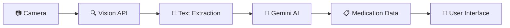

# MedPal 💊📱

> **AI-Powered Universal Product Scanner & Health Information App**

MedPal is a comprehensive React Native application that uses cutting-edge AI technology to analyze any product through camera scanning. From prescription medications to supplements, consumables, and everyday products - MedPal instantly provides structured health information, usage guidance, benefits, and potential effects for anything you scan.

[](https://reactnative.dev/)
[](https://expo.dev/)
[](https://www.typescriptlang.org/)
[](https://ai.google.dev/)

## 🌟 Key Features

### 📸 **Universal Product Scanning**
- **Instant OCR**: Powered by Google Cloud Vision API
- **Live Camera Integration**: Real-time product label scanning
- **High Accuracy**: Advanced text recognition for any product type
- **Immediate Navigation**: Seamless camera-to-results flow with animated loading

### 🧠 **Smart AI Analysis**
- **Universal Product Intelligence**: Analyzes medications, supplements, consumables, and everyday products
- **Structured Information**: Name, doses/servings, frequency, usage instructions
- **Health Benefits**: Treatment purposes and beneficial effects for any product
- **Realistic Safety Info**: Actual side effects and risks based on product type
- **Contextual Responses**: Different information depth based on product category

### 🎨 **Polished User Experience**
- **Gesture-Free Navigation**: No accidental swipe-backs, button-only navigation
- **Toggle Information Display**: Switch between structured summary and detailed description
- **Real Image Display**: Shows your actual captured photo in results
- **Loading Animation**: Custom GIF with fallback for smooth transitions
- **State Management**: Fresh data for each scan, no cached results

### 📱 **Professional Interface**
- **Material Design**: React Native Paper components with custom theming
- **Structured Data Cards**: Clean grey boxes for medication information with sub-instructions
- **Responsive Layout**: Optimized for all screen sizes
- **Error Handling**: 30-second timeouts with graceful fallbacks

### 🔒 **Privacy & Security**
- **Local Processing**: Images processed in real-time, not stored permanently
- **Secure APIs**: Encrypted communication with Google AI services
- **No Gesture Interference**: Prevents accidental navigation to sensitive states

## 🚀 Quick Start

### Prerequisites
- Node.js 18+ installed
- Expo CLI installed globally: `npm install -g @expo/cli`
- iOS Simulator or Android Emulator (or physical device with Expo Go)

### Installation

```bash
# Clone the repository
git clone https://github.com/AnamGTR99/medpal_ai.git
cd medpal_ai

# Install dependencies
npm install

# Set up environment variables
cp .env.example .env
# Add your API keys to .env (see Setup Guide below)

# Start the development server
npm start
```

### Development Options
- **📱 iOS**: Press `i` to open in iOS Simulator
- **🤖 Android**: Press `a` to open in Android Emulator  
- **🌐 Web**: Press `w` to open in web browser
- **📲 Physical Device**: Scan QR code with Expo Go app

## ⚙️ Setup Guide

### 1. API Keys Configuration

MedPal requires two Google API keys for full functionality:

#### Google Cloud Vision API (OCR)
1. Go to [Google Cloud Console](https://console.cloud.google.com/)
2. Create a new project or select existing one
3. Enable **Cloud Vision API**
4. Create an API key with Vision API access
5. **Important**: Enable billing (required even for free tier)

#### Google Gemini AI API (Analysis)
1. Visit [Google AI Studio](https://ai.google.dev/)
2. Create a new API key
3. No billing required for Gemini

#### Environment Setup
```bash
# Copy the example environment file
cp .env.example .env
```

Edit `.env` and add your keys:
```env
GOOGLE_VISION_API_KEY=your_vision_api_key_here
GOOGLE_GEMINI_API_KEY=your_gemini_api_key_here
```

### 2. Platform-Specific Setup

#### iOS Setup
- Xcode 14+ required for iOS development
- iOS Simulator available through Xcode

#### Android Setup  
- Android Studio with SDK Platform-Tools
- Android Emulator or physical device with USB debugging

## 📱 App Architecture

### Core Components

```
MedPal/
├── app/                      # Expo Router file-based navigation
│   ├── (tabs)/              # Tab navigation screens
│   │   ├── index.tsx        # Home screen with medication list
│   │   ├── scan.tsx         # Scan tab (opens camera modal)
│   │   └── settings.tsx     # Settings and profile
│   ├── scan-modal.tsx       # Full-screen camera interface
│   ├── processing.tsx       # Loading screen with AI processing
│   └── confirm-scan.tsx     # Structured results display
├── components/              # Reusable UI components
│   ├── DateTracker.tsx      # Scrollable date selector
│   ├── MedicationCard.tsx   # Individual medication display
│   ├── PlaceholderIcons.tsx # Icon system
│   └── ScanConfirmModal.tsx # AI result confirmation
├── services/                # Business logic
│   └── AIService.ts         # Google AI integration
├── theme/                   # Design system
│   └── theme.ts             # Colors, typography, spacing
├── types/                   # TypeScript definitions
│   └── index.ts             # App-wide type definitions
└── test-ai-pipeline/        # Comprehensive testing suite
    └── README.md            # Detailed testing documentation
```

### Technology Stack

- **Frontend**: React Native with Expo
- **Language**: TypeScript for type safety
- **Navigation**: Expo Router (file-based)
- **UI Library**: React Native Paper (Material Design)
- **State Management**: React Context API
- **AI Services**: Google Cloud Vision + Gemini AI
- **Camera**: Expo Camera with live preview
- **Styling**: StyleSheet with custom theme system

## 🧪 Testing Suite

MedPal includes a comprehensive AI pipeline testing framework located in `test-ai-pipeline/`.

### Quick Test Commands

```bash
cd test-ai-pipeline

# Test individual components
node test-vision-api.js sample-images/prescription-test.JPG
node test-enhanced-gemini.js --file sample-ocr-text.txt

# Test complete pipeline
node test-enhanced-full-pipeline.js sample-images/prescription-test.JPG

# Batch test multiple images
node test-enhanced-full-pipeline.js --batch sample-images/
```

### Testing Features
- **Individual API Testing**: Test Vision and Gemini APIs separately
- **Full Pipeline Testing**: End-to-end image → medication data flow
- **Enhanced Analysis**: Comprehensive medication information with safety data
- **Batch Testing**: Test multiple prescription images
- **Performance Benchmarking**: Timing and accuracy metrics
- **Detailed Logging**: All results saved to timestamped JSON files

📋 **[Complete Testing Documentation](test-ai-pipeline/README.md)**

## 🎯 AI Pipeline Overview



### Pipeline Stages

1. **📷 Image Capture**: User photographs any product label
2. **🔍 OCR Processing**: Google Vision extracts text with high accuracy
3. **🧠 AI Analysis**: Gemini AI analyzes and categorizes product information
4. **📋 Data Structuring**: Organized into structured, actionable format
5. **👤 Display**: Clean, toggle-able information presented to user

### Enhanced Information Output

- **💊 Basic Details**: Name, doses/servings, frequency, instructions
- **🎯 Treatment/Benefits**: What the product helps with or is used for
- **⚠️ Side Effects/Risks**: Realistic effects and warnings based on product type
- **📋 Structured Display**: Toggle between summary cards and detailed description
- **📸 Visual Context**: Shows the actual captured image alongside data
- **🔄 State Management**: Fresh analysis for each scan without cached results

### Product Categories Supported

- **💊 Prescription Medications**: Full medical analysis with dosage and safety info
- **💉 Supplements & Vitamins**: Health benefits, dosage recommendations, precautions  
- **🚬 Consumables** (like nicotine products): Effects, usage, and health considerations
- **🥤 Everyday Products**: Basic benefits (like hydration for water) and safety info

## 📊 Project Status

### ✅ Completed Features
- [x] Complete React Native app with Expo Router
- [x] Custom tab navigation with elevated scan button  
- [x] Live camera integration with permissions
- [x] Google Cloud Vision API integration (OCR)
- [x] Google Gemini AI integration (analysis)
- [x] **Universal Product Intelligence**: Analyzes any product type
- [x] **Structured Results Display**: Toggle between summary and detailed view
- [x] **Real Image Integration**: Shows captured photos in results
- [x] **Gesture-Free Navigation**: Button-only flow, no accidental swipe-backs
- [x] **Enhanced State Management**: Fresh data for each scan
- [x] **Professional UI**: Grey info boxes with sub-instructions display
- [x] **Loading Animation**: Custom GIF with fallback support
- [x] **30-Second Timeouts**: Robust error handling and recovery
- [x] **Contextual Health Info**: Realistic benefits/risks for all product types
- [x] TypeScript throughout for type safety
- [x] Material Design UI components with custom theming
- [x] Environment-based configuration with proper Expo integration

### 🚧 Future Enhancements
- [ ] Medication reminders and notifications
- [ ] Personal medication history tracking
- [ ] Integration with health apps (Apple Health, Google Fit)
- [ ] Multi-language support
- [ ] Voice-guided instructions
- [ ] Pill identification by visual recognition
- [ ] Pharmacy integration for refills
- [ ] Family account management

## 🤝 Contributing

We welcome contributions to MedPal! Here's how you can help:

### Development Setup
1. Fork the repository
2. Create a feature branch: `git checkout -b feature/amazing-feature`
3. Make your changes and test thoroughly
4. Run the test suite: `cd test-ai-pipeline && npm test`
5. Commit with clear message: `git commit -m 'feat: add amazing feature'`
6. Push to your fork: `git push origin feature/amazing-feature`
7. Open a Pull Request

### Areas for Contribution
- 🎨 **UI/UX Improvements**: Enhance user experience and accessibility
- 🧪 **Testing**: Add test cases for edge cases and new features
- 🌐 **Internationalization**: Add support for multiple languages
- 📱 **Platform Features**: iOS/Android specific optimizations
- 🤖 **AI Enhancements**: Improve prompt engineering and accuracy
- 📚 **Documentation**: Improve guides and add tutorials

## 🚨 Important Disclaimers

**⚠️ Medical Information Disclaimer**
- MedPal is a medication information tool, not a replacement for professional medical advice
- Always consult with healthcare professionals before making medication decisions
- The AI-generated information is for educational purposes only
- In case of medical emergencies, contact emergency services immediately

**🔒 Privacy & Data**
- Prescription images are processed in real-time and not permanently stored
- API communications are encrypted and secure
- No personal health information is shared with third parties
- Users are responsible for protecting their own medication information

## 📞 Support & Resources

### Getting Help
- 📚 **Documentation**: Comprehensive guides in `/test-ai-pipeline/README.md`
- 🐛 **Issues**: Report bugs via GitHub Issues
- 💬 **Discussions**: Ask questions in GitHub Discussions
- 📧 **Contact**: For security issues, email the maintainers directly

### Useful Links
- [Expo Documentation](https://docs.expo.dev/)
- [React Native Guide](https://reactnative.dev/docs/getting-started)
- [Google Cloud Vision API](https://cloud.google.com/vision/docs)
- [Google Gemini AI](https://ai.google.dev/docs)

## 📄 License

This project is licensed under the MIT License - see the [LICENSE](LICENSE) file for details.

## 🙏 Acknowledgments

- **Google AI Platform** for providing powerful Vision and Gemini APIs
- **Expo Team** for the excellent React Native development platform
- **React Native Community** for comprehensive libraries and tools
- **Open Source Contributors** who make projects like this possible

---

<div align="center">

**Built with ❤️ for safer medication management**

*MedPal - Your AI-Powered Medication Companion*

[](https://github.com/AnamGTR99/medpal_ai)
[](https://github.com/AnamGTR99/medpal_ai/fork)

</div>